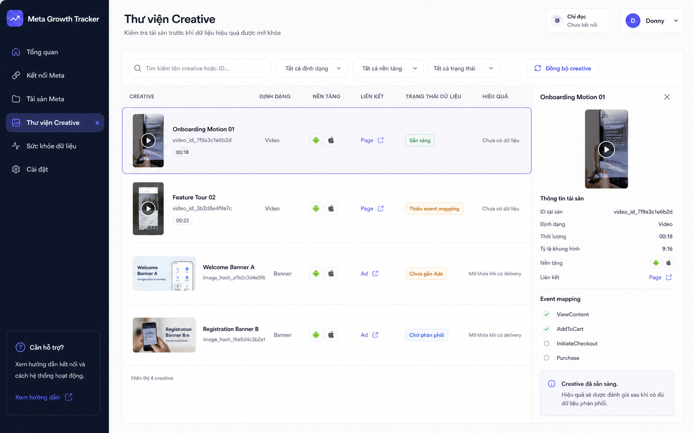

# Meta Creative Growth Tracker

[](https://github.com/ThuongPhan90/meta-creative-growth-tracker/actions/workflows/ci.yml)
[](LICENSE)

[](https://vercel.com/new/clone?repository-url=https%3A%2F%2Fgithub.com%2FThuongPhan90%2Fmeta-creative-growth-tracker)

Web app tự host để một owner kết nối Meta Marketing API, rà soát Business
Portfolio/BM, ad account, campaign và đánh giá hiệu quả creative theo video hoặc
banner. Ứng dụng chỉ đọc dữ liệu quảng cáo; không tạo, sửa hay tắt chiến dịch.

> Trạng thái: personal v1 sẵn sàng triển khai production cho một owner, với các
> giới hạn dữ liệu và vận hành được ghi rõ bên dưới. Hãy hoàn tất checklist Meta,
> database, privacy và bảo mật trước khi kết nối tài khoản thật.



## Bài toán dự án giải quyết

- Một nơi để xem nhiều BM, ad account và Page mà tài khoản Meta được cấp quyền.
- Tìm campaign/ad của từng buyer từ cấu trúc Meta, không dựa vào file nhập tay.
- Dùng `video_id`/`image_hash` làm identity cho asset vật lý; tên và mã chuẩn hóa
  chỉ là alias/nhóm nghiệp vụ để phân tích.
- So sánh Spend, Impressions, Reach, CTR, Meta-attributed Install,
  Meta-attributed Registration, Meta-attributed CPI/CPA, Hook Rate và Hold Rate.
- Có Demo mode an toàn để học/đánh giá giao diện trước khi kết nối tài khoản thật.
- Tự đồng bộ hàng ngày bằng Vercel Cron và cho phép owner chủ động sync.

## Mô hình triển khai

Mỗi bản triển khai là một instance độc lập cho một owner:

```text
Meta App riêng + Meta token riêng
              │
              ▼
Next.js trên Vercel ─────► Postgres riêng qua Vercel Marketplace
              │
              └──────────► Cron đồng bộ hàng ngày
```

Không dùng chung `META_APP_ID`, `META_APP_SECRET`, token mã hóa hoặc database
giữa các học viên/khách hàng. Fork hoặc deploy mới phải tạo Meta App credentials
và Postgres riêng.

## Bắt đầu nhanh ở local

Yêu cầu:

- Node.js `24.x`
- pnpm `10.34.5`
- Postgres nếu chạy Live mode

```bash
git clone https://github.com/ThuongPhan90/meta-creative-growth-tracker.git
cd meta-creative-growth-tracker
corepack enable
pnpm install
cp .env.example .env.local
pnpm dev
```

PowerShell:

```powershell
git clone https://github.com/ThuongPhan90/meta-creative-growth-tracker.git
Set-Location meta-creative-growth-tracker
corepack enable
pnpm install
Copy-Item .env.example .env.local
pnpm dev
```

Nếu máy không có Corepack/pnpm, cài đúng version bằng
`npm install --global pnpm@10.34.5`, rồi chạy lại từ bước `pnpm install`.

Mở `http://localhost:3000`.

Để xem giao diện với dữ liệu mẫu, giữ:

```dotenv
DEMO_MODE=true
```

## Từ repo đến Live

Deploy Vercel không đồng nghĩa Meta tự kết nối. Luồng an toàn của personal v1 là:

1. import repo vào Vercel với `DEMO_MODE=true`;
2. chốt một production URL ổn định và đặt `APP_URL` bằng đúng origin đó;
3. public `/privacy` và `/data-deletion`, rồi cấu hình Meta callback trên cùng
   domain;
4. tạo Postgres riêng, thêm server secrets và Meta credentials;
5. redeploy với `DEMO_MODE=false`, nhập mã owner và hoàn tất Meta OAuth;
6. mở **Cài đặt** để chốt timezone, lookback, ngưỡng đủ dữ liệu và action types;
7. sync khoảng nhỏ, sau đó đối chiếu một ngày với Ads Manager trước khi mở rộng.

Vercel có thể đưa bản Demo lên mạng rất nhanh. Live mode vẫn cần owner tự tạo
Meta App, database và secrets; repo không thể đóng gói sẵn các credential này.
Đọc theo thứ tự:

1. [Triển khai Vercel](docs/vercel-deployment.md)
2. [Demo mode và Live mode](docs/demo-live-modes.md)
3. [Thiết lập Meta App](docs/meta-app-setup.md)
4. [Biến môi trường](docs/environment-variables.md)

## Kiểm tra chất lượng

```bash
pnpm lint
pnpm typecheck
pnpm test
pnpm build
```

Hoặc chạy toàn bộ:

```bash
pnpm check
```

## Cấu trúc tài liệu

| Tài liệu | Nội dung |
|---|---|
| [docs/architecture.md](docs/architecture.md) | Kiến trúc, luồng auth/sync và ranh giới read-only |
| [docs/fidelity-ledger.md](docs/fidelity-ledger.md) | Đối chiếu concept/render desktop, mobile và interaction |
| [docs/data-semantics.md](docs/data-semantics.md) | Grain, công thức KPI, logic gộp creative và giới hạn dữ liệu |
| [docs/meta-app-setup.md](docs/meta-app-setup.md) | Tạo Meta App, OAuth, quyền và App Review |
| [docs/vercel-deployment.md](docs/vercel-deployment.md) | Deploy bằng GitHub + Vercel + Marketplace Postgres |
| [docs/environment-variables.md](docs/environment-variables.md) | Bảng biến môi trường và cách tạo secret |
| [docs/demo-live-modes.md](docs/demo-live-modes.md) | Sự khác nhau giữa dữ liệu mẫu và dữ liệu Meta |
| [docs/privacy-data-deletion.md](docs/privacy-data-deletion.md) | URL pháp lý, contract disconnect/callback và checklist xóa dữ liệu |
| [docs/troubleshooting.md](docs/troubleshooting.md) | Lỗi OAuth, quyền, sync, database và cron |
| [docs/course-guide.md](docs/course-guide.md) | Lộ trình dùng repo cho khóa học/public template |

## Phạm vi và giới hạn

- Ứng dụng không phải Ads Manager thay thế và không thay đổi trạng thái quảng cáo.
- Chỉ thấy BM, Page, ad account và chiến dịch mà Meta user/token thật sự được cấp
  quyền.
- “Toàn bộ BM” nghĩa là toàn bộ phạm vi truy cập của token, không phải toàn bộ tài
  sản tồn tại trong doanh nghiệp nếu owner chưa được cấp quyền.
- Install/Registration trong ứng dụng là conversion **được Meta attribution**,
  phụ thuộc action type, attribution setting và thời điểm truy vấn; không phải số
  cài đặt/đăng ký độc lập được backend ứng dụng xác nhận.
- Reach không cộng dồn tuyệt đối chính xác giữa các ngày/nhóm dữ liệu trùng người;
  xem [data semantics](docs/data-semantics.md).
- Creative wrapper ID có thể thay đổi/tái tạo; asset vật lý được nhận diện bằng
  `video_id` hoặc `image_hash`. Tên/mã chuẩn hóa có thể trùng và không được dùng
  thay cho physical identity.
- Trong Live mode, cấu hình KPI/sync trong **Cài đặt** và bảng
  `tracker.app_settings` là nguồn chuẩn. Không dùng biến môi trường để thay
  timezone, lookback hoặc action type của một deployment đã kết nối.

## Bảo mật

Không commit `.env.local`, App Secret, access token, connection string hoặc dữ
liệu export từ Meta. Báo cáo lỗ hổng theo [SECURITY.md](SECURITY.md).

## Đóng góp

Xem [CONTRIBUTING.md](CONTRIBUTING.md). Mọi thay đổi hành vi tính KPI phải kèm:

- định nghĩa grain;
- fixture/test;
- ghi chú migration nếu ảnh hưởng dữ liệu đã lưu;
- cập nhật `docs/data-semantics.md`.

## Giấy phép

[MIT](LICENSE). Meta và Facebook là nhãn hiệu của Meta Platforms, Inc. Dự án này
không được Meta bảo trợ hay chứng nhận.
