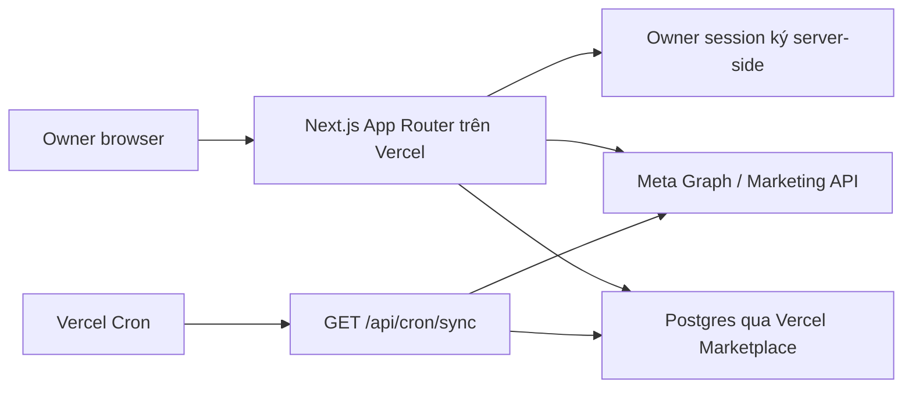
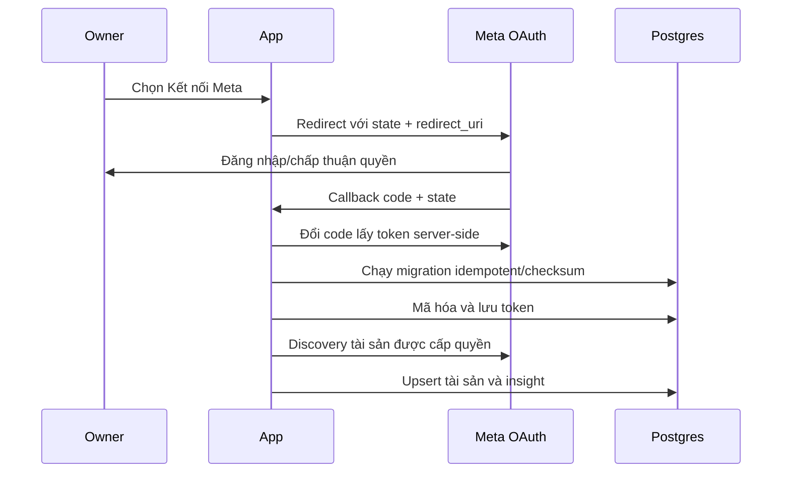

# Kiến trúc

## Mục tiêu

Ứng dụng owner-only, read-only, có thể khám phá tài sản Meta mà owner được cấp
quyền và lưu insight theo ngày để phân tích creative ổn định hơn so với gọi API
trực tiếp trên mỗi lần mở dashboard.

## Thành phần



### Web

- Next.js App Router, React và TypeScript.
- Route UI chỉ hiển thị dữ liệu owner được phép xem.
- Meta App Secret và access token chỉ được dùng server-side.

### Meta integration

- OAuth để owner cấp quyền.
- Discovery theo chuỗi: owner → Business Portfolio/BM → ad accounts/Pages →
  campaigns/ad sets/ads/creative.
- Insights được đọc theo ngày và cursor pagination.
- API là read-only; không gọi mutation để sửa quảng cáo.

### Persistence

Postgres của từng deployment lưu:

- owner/session state cần thiết;
- token ở dạng đã mã hóa;
- tài sản Meta đã discovery;
- daily insights và trạng thái sync;
- mapping/normalization creative.

Schema thực tế trong migration là nguồn chuẩn kỹ thuật. Không nối một database
production cho nhiều deployment độc lập.

### Scheduler

`vercel.json` gọi `/api/cron/sync` lúc `01:00 UTC` mỗi ngày. Vercel Cron dùng UTC,
không dùng reporting timezone trong Settings để đổi lịch cron. Route phải kiểm
tra:

```text
Authorization: Bearer <CRON_SECRET>
```

Cron có thể được gọi lặp; sync phải idempotent/upsert theo khóa tự nhiên, không
cộng dồn mù. Vercel không đảm bảo retry khi invocation thất bại, vì vậy dashboard
cần hiển thị lần sync cuối và lỗi gần nhất.

Manual sync và cron hiện cùng chạy đồng bộ trong Vercel Function. `maxDuration`
trong source là yêu cầu runtime, không vượt được giới hạn thật của plan. Khi số
account/pagination/lookback lớn, cần giảm lookback trong Settings hoặc phát triển
kiến trúc chia job/background queue.

### Settings

`tracker.app_settings` là nguồn chuẩn của cấu hình Live:

- reporting timezone và reporting currency;
- sync lookback;
- ngưỡng tối thiểu để đánh giá đủ dữ liệu;
- Meta action types cho Install và Registration.

Owner thay đổi qua trang **Cài đặt** sau khi có owner session. Cron, manual sync
và báo cáo đọc cùng record này; Vercel env chỉ bootstrap hạ tầng, Meta và bảo mật.

## Luồng OAuth



`state` phải chống CSRF, redirect URI phải khớp tuyệt đối và callback không được
ghi token vào URL/log/browser storage.

## Ranh giới tin cậy

| Biên | Quy tắc |
|---|---|
| Browser → app | Session owner, CSRF/state, input validation |
| App → Meta | Token tối thiểu quyền, server-side, retry có backoff |
| App → Postgres | Parameterized query, TLS, migration kiểm soát |
| Cron → app | `CRON_SECRET`, idempotency, lock nếu sync dài |
| Preview → production | Secret và database tách riêng |

## Multi-BM, multi-account và multi-Page

Một owner có thể thấy nhiều BM/Page/ad account nếu token có quyền. Mọi record phải
giữ `business_id`, `account_id`, `page_id` khi có, thay vì chỉ lưu tên. Tên có thể
trùng hoặc bị đổi; Meta ID mới là identity kỹ thuật.

Creative có thể tái sử dụng qua nhiều ad/account/Page. Vì vậy:

- `ad_id` là grain phân phối;
- `creative_id` nhận diện creative wrapper của Meta, không nhận diện chắc chắn
  file media vật lý;
- `video_id` hoặc `image_hash` là identity vật lý chuẩn khi Meta cung cấp;
- `asset_key` nội bộ nên có dạng `video:<video_id>` hoặc
  `image:<image_hash>`;
- `creative_code` và tên chuẩn hóa chỉ là alias/quy ước nhóm nghiệp vụ;
- report có thể nhóm theo alias nhưng phải cho drill-down về asset identity,
  creative wrapper, ad và account gốc.

## Không nằm trong phạm vi personal v1

- Tạo/sửa/tắt campaign, ad set hoặc ad.
- Quản trị quyền BM.
- CRM hoặc doanh thu xác nhận ngoài Meta.
- Multi-tenant SaaS công khai.
- Lưu file video gốc nếu Meta chỉ trả URL tạm thời.
